# Path Planning Benchmarking

Benchmarking RRT-Connect, RRT*, A*, and Dijkstra on static, dynamic, and real-world floorplan maps with quantitative performance analysis.

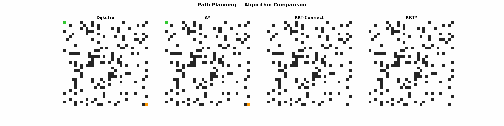

## Overview

This project implements four path planning algorithms from scratch in Python and benchmarks them head-to-head on identical environments. The goal is to quantify the tradeoffs between optimality, speed, memory, and reliability across different obstacle densities.

## Algorithms

| Algorithm | Type | Optimal? | Key Strength |
|-----------|------|----------|-------------|
| **Dijkstra** | Graph search | Yes | Guaranteed shortest path |
| **A*** | Graph search + heuristic | Yes | Fewer nodes explored than Dijkstra |
| **RRT-Connect** | Bidirectional sampling | No | Fastest planning time |
| **RRT*** | Sampling + rewiring | Asymptotically | Path quality improves over iterations |

## Key Results (Phase A — Static Grid)

**50×50 grid, 50 trials per configuration, 3 obstacle densities (10%, 20%, 30%)**

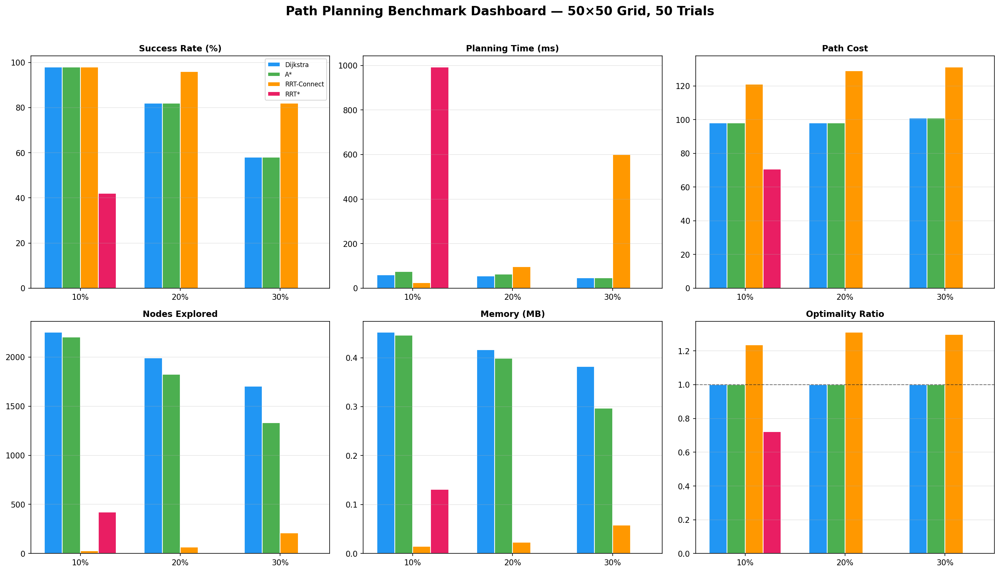

### Findings

- **Dijkstra and A* produce identical optimal paths.** A* explores 8-22% fewer nodes depending on density, confirming heuristic efficiency.
- **RRT-Connect is 2-3x faster** than grid-based algorithms at low density but produces paths 24-31% longer than optimal.
- **RRT-Connect has higher success rates** at 20% and 30% density (96% and 82%) vs grid-based algorithms (82% and 58%) — continuous space sampling finds narrow gaps that grid discretization misses.
- **RRT* struggles in dense grid environments.** 42% success at 10% density, 0% at higher densities. RRT* is designed for open configuration spaces (robot arm planning), not cluttered grid navigation. This is a known limitation, not a bug.

### Optimality Ratio

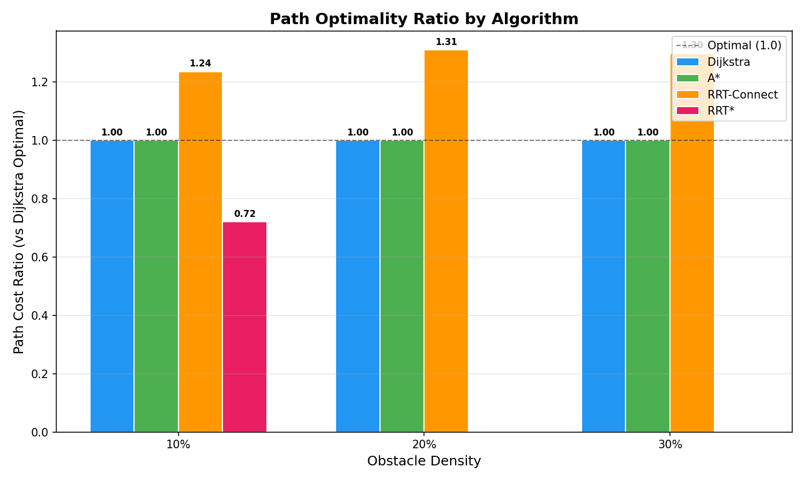

RRT-Connect paths cost 1.24-1.31x the optimal. RRT* (where it succeeds) shows ratio of 0.72 — below 1.0 because it moves in continuous space with diagonal shortcuts, while Dijkstra is constrained to cardinal grid moves.

## Individual Algorithm Visualizations

### Dijkstra — Explores everything, finds optimal path
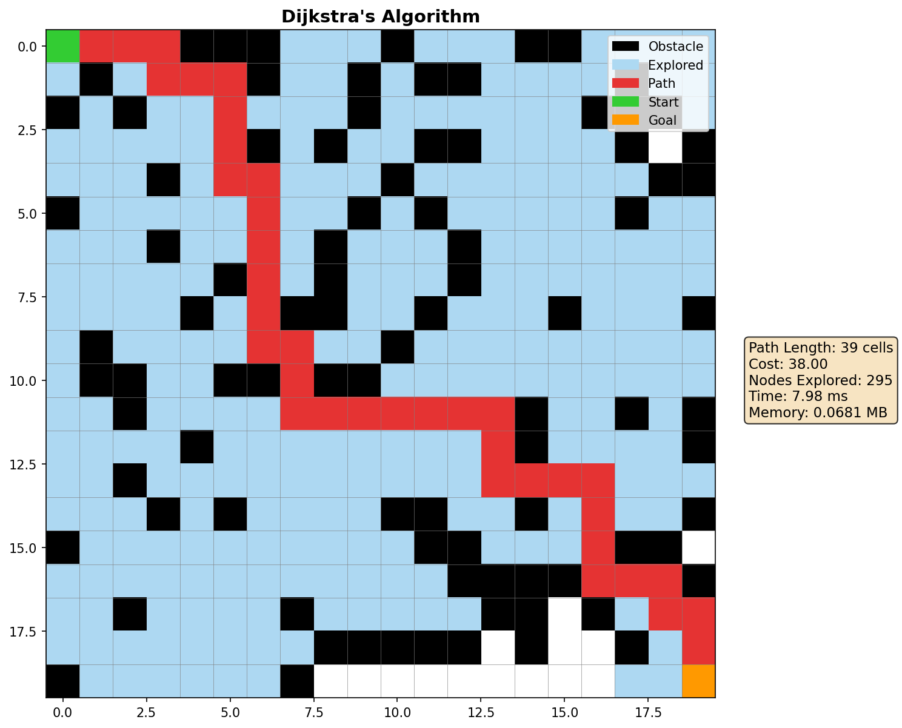

### A* — Heuristic focuses search toward goal
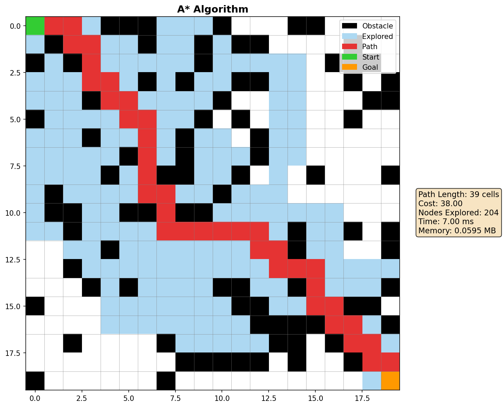

### RRT-Connect — Two trees grow and meet
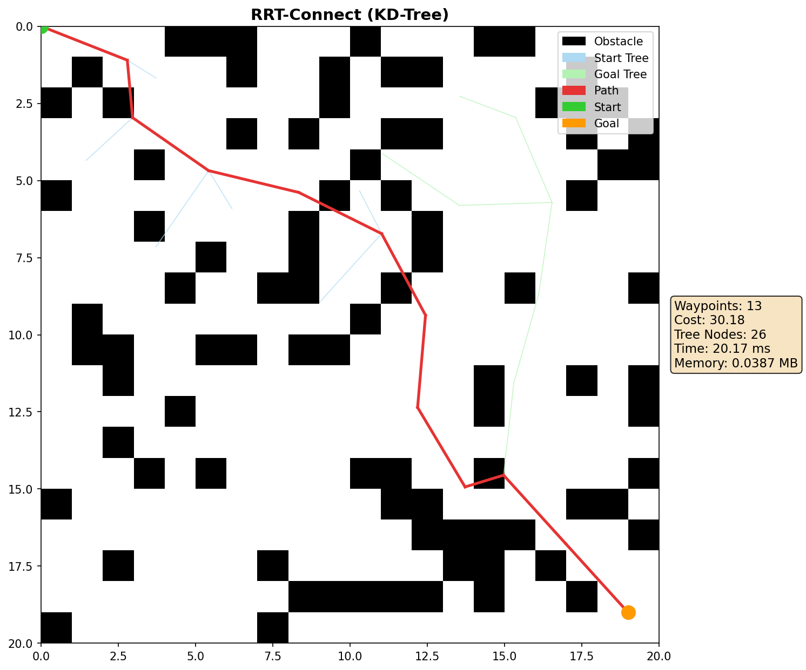

### RRT* — Dense tree with rewiring converges toward optimal
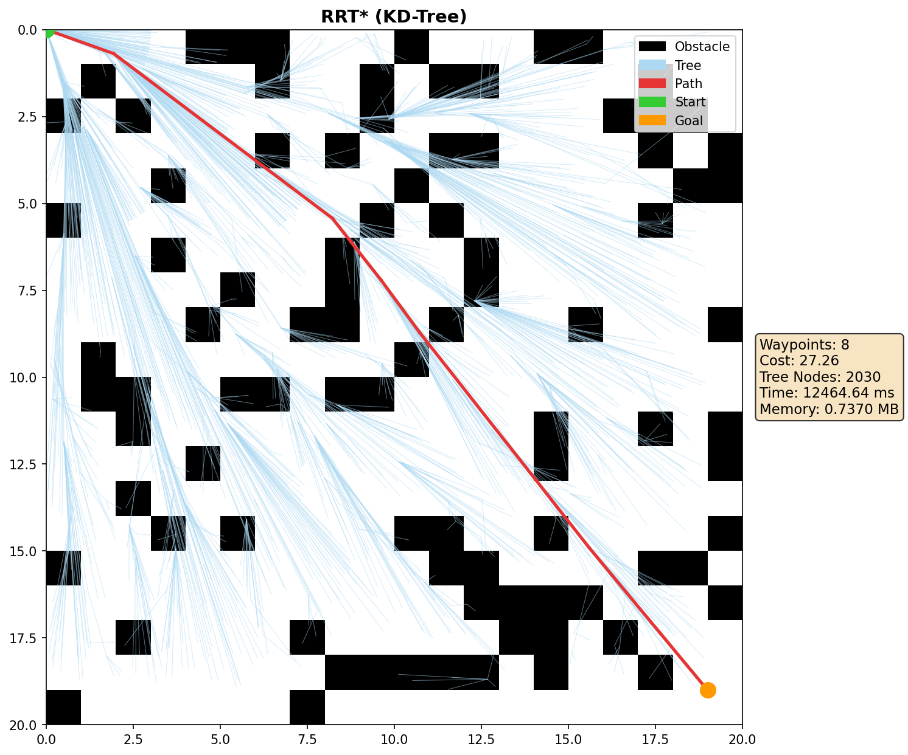

## Phase B — Dynamic Environment Replanning

D* Lite vs A* full replan with moving obstacles. The robot navigates while obstacles move on preset patrol paths. D* Lite updates incrementally; A* restarts from scratch every step.

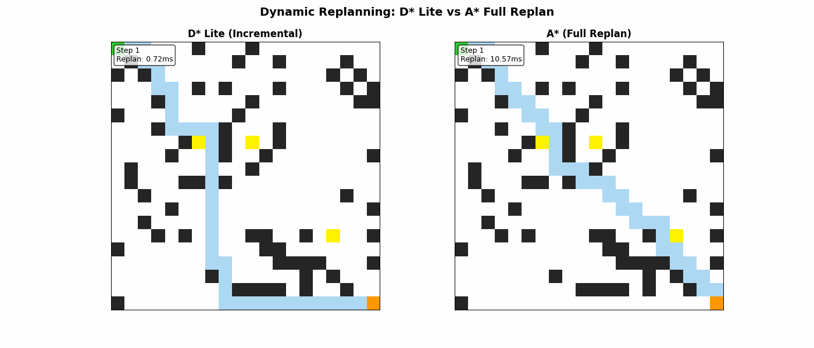

### Replanning Time Comparison

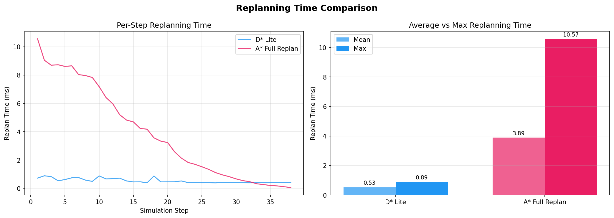

### Findings

- **D* Lite is ~7x faster** than A* full replan on average (0.53 ms vs 3.89 ms per step).
- A* replan time is highest when the robot is far from the goal (10.57 ms) and drops as it approaches. D* Lite stays consistently low (~0.5 ms) regardless of robot position.
- Both algorithms successfully navigate to the goal despite moving obstacles.
- D* Lite's advantage grows on larger grids — incremental updates scale better than full replanning.

## Phase C — Real-World Campus Navigation

Path planning on the Northeastern University campus with terrain-weighted costs. Buildings are impassable, grass costs 5x more than sidewalks, encouraging algorithms to prefer walkways.

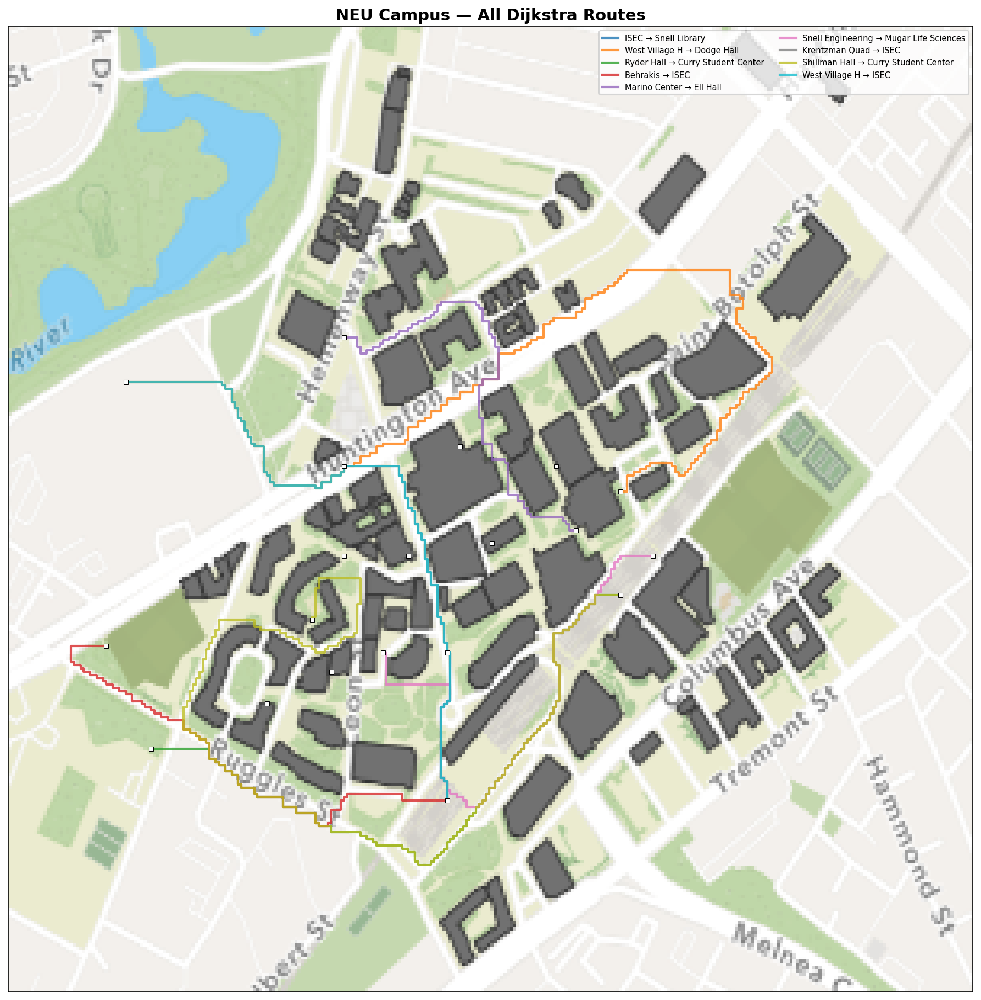

### Terrain Costs

| Terrain | Cost | Description |
|---------|------|-------------|
| Sidewalk/Path | 1.0x | Preferred walking route |
| Road | 2.0x | Walkable but less preferred |
| Grass/Park | 5.0x | Walkable but discouraged |
| Building/Water | Impassable | Cannot traverse |

### Findings

- 9/10 building-to-building routes successfully navigated across campus
- Dijkstra and A* find identical optimal weighted paths; A* is ~2x faster on average
- RRT-Connect finds paths faster but with higher cost due to suboptimal routing
- Weighted terrain costs cause paths to naturally follow sidewalks over cutting through grass

### Individual Routes

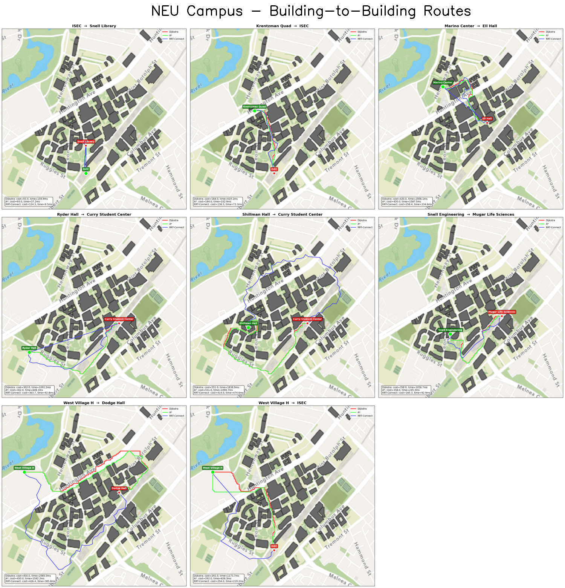

## Project Structure

```
├── src/
│   ├── grid.py                    # Grid class with configurable obstacles
│   ├── dijkstra.py                # Dijkstra's algorithm
│   ├── astar.py                   # A* with Euclidean heuristic
│   ├── rrt_connect.py             # RRT-Connect (bidirectional)
│   ├── rrt_connect_kd.py          # RRT-Connect with KD-Tree optimization
│   ├── rrt_star.py                # RRT* with rewiring
│   ├── rrt_star_kd.py             # RRT* with KD-Tree optimization
│   ├── benchmark.py               # Benchmarking runner
│   ├── visualize_dijkstra.py      # Dijkstra visualization (PNG + GIF)
│   ├── visualize_astar.py         # A* visualization (PNG + GIF)
│   ├── visualize_rrt_connect.py   # RRT-Connect visualization
│   ├── visualize_rrt_connect_kd.py
│   ├── visualize_rrt_star.py      # RRT* visualization
│   ├── visualize_rrt_star_kd.py
│   ├── visualize_benchmark.py     # Benchmark bar charts
│   ├── visualize_side_by_side.py  # 4-algorithm comparison image
│   └── visualize_combined_gif.py  # Combined animation
├── results/
│   └── benchmark_results.csv      # Raw benchmark data
├── visualizations/phase_a         # All generated plots and GIFs
├── maps/                          # Real floorplan maps (Phase E)
└── requirements.txt
```

## Setup

```bash
git clone https://github.com/krishsantoki/path-planning-benchmarking.git
cd path-planning-benchmarking
pip install -r requirements.txt
```

## Usage

Run any algorithm individually:
```bash
python src/dijkstra.py
python src/astar.py
python src/rrt_connect_kd.py
python src/rrt_star_kd.py
```

Run the full benchmark:
```bash
python src/benchmark.py
```

Generate all visualizations:
```bash
python src/visualize_benchmark.py
python src/visualize_side_by_side.py
python src/visualize_combined_gif.py
```

## Performance Optimization

RRT and RRT* use **KD-Tree** (`scipy.spatial.KDTree`) for nearest neighbor queries, reducing lookup from O(n) to O(log n). This dropped RRT* runtime from ~32s to ~12s on a 20×20 grid at 3000 iterations.

## Roadmap

- [x] **Phase A** — Static grid benchmarking
- [x] **Phase B** — Dynamic environment replanning (D* Lite)
- [x] **Phase C** — Real floorplan maps
- [ ] **Phase D** — Probabilistic planning under motion uncertainty (MDP)

## Tech Stack

Python 3.11 · NumPy · Matplotlib · SciPy · OpenCV (Phase C)